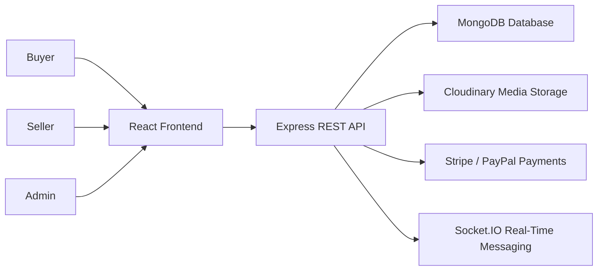
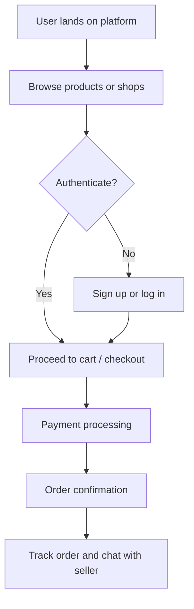

# Complete Case Study - Multi-Vendor E-commerce Platform

## Overview

This project is a full-featured multi-vendor e-commerce platform designed to bring together buyers, sellers, and administrators in a single, connected marketplace. The system was built to simulate the experience of a modern digital retail ecosystem where products can be listed, discovered, purchased, tracked, and managed in real time.

At its core, the platform is not just an online store; it is a modular commerce platform that demonstrates how multiple stakeholders can interact through a shared architecture. Buyers can browse and purchase products, sellers can manage inventory and orders, and administrators can supervise the marketplace with control and visibility. The result is a scalable foundation for building a real-world online marketplace with strong user experience, secure transactions, and extensible business logic.

## Goals of the Project

The primary objective of the platform was to design and build a modern e-commerce solution that reflects the needs of a multi-vendor business model. The project aimed to:

- Create a marketplace where multiple sellers can independently manage their stores and products.
- Provide a seamless shopping experience for buyers through product discovery, cart handling, and checkout.
- Support secure payments and order lifecycle management.
- Enable real-time communication between buyers and sellers.
- Deliver a clean, maintainable architecture that can scale as the platform grows.
- Demonstrate how role-based access, authentication, and modular backend services work together in a production-style application.

## System Architecture Overview

The platform follows a layered MERN architecture with a clear separation between the frontend, backend, database, and real-time services. The frontend delivers a responsive shopping and seller experience, while the backend handles authentication, business rules, order processing, and media uploads. MongoDB stores structured marketplace data, and Cloudinary is used for image management.

This architecture was chosen because it offers flexibility, faster development cycles, and an intuitive structure for building feature-rich applications. It also makes it easier to add future enhancements such as analytics dashboards, advanced inventory tools, loyalty systems, and broader payment integrations.

### System Architecture Diagram

## Key Features

### Multi-Role User System

- Buyer: Can browse products, add them to cart, make payments, track orders, and communicate with sellers.
- Seller: Can create and manage stores, list products, handle incoming orders, and monitor sales activity.
- Admin: Can oversee platform operations, maintain marketplace integrity, and manage high-level business controls.

### Product Management & Shopping

- Product listings with rich details, pricing, stock information, and media.
- Cart and checkout flow for a complete customer journey.
- Search and filtering experience to improve product discoverability.
- Product detail pages designed to support an engaging shopping experience.

### Payment Processing

- Secure payment flow powered by modern payment infrastructure.
- Support for card-based processing through Stripe.
- Flexible payment architecture that can be extended to additional gateways in future iterations.

### Real-Time Messaging

- Buyer-to-seller communication through a chat-based system.
- Message history and conversation management for support and order coordination.
- Real-time delivery of communication updates using WebSocket-based infrastructure.

### Seller Dashboard Features

- Sales tracking and visibility into store performance.
- Order management tools for processing and monitoring purchases.
- Product administration features for updating inventory and listings.
- A structured dashboard experience designed to help sellers operate efficiently.

### API Architecture

The backend exposes a RESTful API organized around domain-specific modules such as users, shops, products, orders, payments, events, conversations, and withdrawals. This modular structure makes the system easier to extend, test, and maintain over time.

### Brand Value Propositions

- Scalability: The platform is structured to support future growth in products, users, and vendors.
- Security: Authentication, token-based sessions, and secure payment handling are central to the design.
- Performance: The architecture is optimized for responsive interactions, efficient data flow, and media delivery.

## Tech Stack

### Backend

- Node.js and Express.js for server-side logic and API development.
- MongoDB with Mongoose for data modeling and database interaction.
- JSON Web Tokens for authentication and secure access control.
- Middleware-based request handling for validation, errors, and routing.

### Frontend

- React for building a modular and dynamic user interface.
- Redux for state management across the application.
- React Router for page navigation and protected routes.
- Tailwind CSS and component-based UI styling for a modern presentation layer.

### File & Media Handling

- Multer for temporary file handling during uploads.
- Cloudinary for storing and serving product and user images efficiently.

### Real-Time Communication

- Socket.IO for live messaging and interactive events.
- Real-time communication architecture for buyer-seller engagement.

### Development & Deployment Tools

- Nodemon for development efficiency.
- Environment-based configuration for secure runtime settings.
- Modular project structure supporting future CI/CD and containerized deployment workflows.

## Challenges & Solutions

Building a multi-vendor marketplace comes with complexity, especially when multiple roles and workflows must coexist within one application. Several challenges shaped the implementation:

1. Role-Based Complexity
   - The system needed to support different user journeys for buyers, sellers, and administrators without breaking the experience.
   - The solution was to design dedicated routes, protected access layers, and role-specific business logic.

2. Secure Transactions and Authentication
   - Commerce platforms require trust, especially around payments and account access.
   - JWT-based authentication and secure payment integration were introduced to strengthen reliability and user confidence.

3. Real-Time Collaboration
   - Messaging and user interaction demand fast and dependable communication.
   - WebSocket-based communication was integrated to support real-time conversations between marketplace participants.

4. Media and Product Management at Scale
   - Product images and assets can become heavy and difficult to manage without a proper storage strategy.
   - Cloudinary was adopted to provide scalable image delivery and simplified media handling.

## Database Design

The database design is centered around a relational-style document model in MongoDB, where each major domain is represented as a collection with clear ownership and relationships. The key entities include:

- Users: Stores buyer and seller account information, profile data, and authentication-related details.
- Shops: Represents seller-owned stores and their organizational identity.
- Products: Holds product metadata, pricing, stock, reviews, and linked seller information.
- Orders: Tracks customer purchases, payment status, shipping information, and transaction details.
- Conversations and Messages: Manage real-time user communication and message records.
- Coupons and Events: Support promotional and campaign-driven marketplace features.
- Withdrawals: Capture seller payout and financial workflow records.

This structure enables the platform to remain flexible while preserving strong data organization for commerce-specific use cases.

## Application Flow Diagram

## User Flow

1. A user visits the platform and explores featured products, shops, and categories.
2. The user registers or logs in to access personalized features.
3. The user browses product details, adds items to the cart, and proceeds to checkout.
4. Payment is processed securely, and the order is recorded in the system.
5. The user can track the order status and communicate with the seller if needed.

## Seller Flow

1. A seller creates an account and activates their storefront.
2. The seller adds products, defines pricing, and uploads media.
3. The seller monitors product listings, inventory, and incoming orders.
4. The seller uses the dashboard to manage sales and respond to buyer inquiries.
5. The seller can review order progress and maintain a consistent customer experience.

## Admin Flow

1. An administrator accesses the platform with elevated permissions.
2. The admin oversees seller registrations, platform activity, and order operations.
3. The admin monitors marketplace health and ensures policy compliance.
4. The admin can support platform growth through configuration, moderation, and operational oversight.

## Best Practices

### Authentication & Security

- JWT-based authentication ensures secure access to protected resources.
- Role-based access control helps maintain clear boundaries between buyers, sellers, and administrators.
- Secure handling of payment and user data is a primary design concern.

### Component Architecture

- The frontend is organized around reusable and modular components.
- Backend services are separated by function to keep the codebase maintainable and extensible.
- The application structure supports future scaling and easier feature development.

### Error Handling & User Experience

- Centralized error handling improves reliability and consistency across the platform.
- Clear user flows and role-based interfaces support a smoother experience.
- Modular design makes debugging and future improvement more efficient.

---

This project represents a practical and modern approach to building a multi-vendor e-commerce platform with real-world business logic, secure transactions, and a user-centric architecture. It serves as both a functional marketplace prototype and a strong example of how a full-stack application can be structured for growth, maintainability, and long-term value.
