# Complete Case Study – Multi-Vendor E-commerce Platform

---

# Overview

The **Multi-Vendor E-commerce Platform** is a full-stack marketplace application built with the MERN stack that brings buyers, sellers, and administrators together within a single, unified ecosystem. Unlike a traditional online store that operates under one business, this platform allows multiple independent vendors to create and manage their own storefronts while customers enjoy a seamless shopping experience from a centralized marketplace.

The application is designed to simulate the architecture and workflows of modern marketplace platforms by combining product management, secure authentication, online payments, order processing, real-time messaging, analytics, and administrative controls into one scalable system.

At its core, the platform addresses one of the biggest challenges faced by small and medium-sized businesses: building an online presence without investing in an entire e-commerce infrastructure. Vendors can register, create their stores, publish products, manage inventory, communicate directly with customers, and track their business performance—all within a shared marketplace environment.

For buyers, the platform offers an intuitive shopping experience with advanced product discovery, wishlists, secure checkout, order tracking, and direct communication with sellers. Administrators maintain overall platform quality by approving sellers, moderating products, monitoring transactions, and overseeing marketplace operations.

Rather than focusing solely on CRUD functionality, this project demonstrates how production-grade marketplace applications are engineered. It incorporates secure authentication, role-based authorization, RESTful API design, cloud media management, third-party payment integration, and real-time communication while maintaining a modular architecture that supports future growth.

From an engineering perspective, this project showcases practical solutions for common software development challenges, including scalable backend architecture, asynchronous workflows, database modeling, secure payment processing, and event-driven communication. Every module has been designed with maintainability, performance, and extensibility in mind, making the project suitable as both a portfolio piece and a reference implementation for marketplace applications.

---

# Project Objectives

Building a successful marketplace requires balancing business requirements with sound engineering principles. The primary objective of this project was to create a scalable, secure, and maintainable platform capable of supporting multiple vendors without compromising the user experience.

The project was developed around the following goals.

## 1. Build a Scalable Marketplace

A marketplace should be capable of growing from a handful of sellers to thousands without requiring significant architectural changes.

To achieve this, the application follows a modular client-server architecture where each layer has clearly defined responsibilities. Business logic remains isolated from presentation logic, enabling new features to be added with minimal impact on existing functionality.

Scalability considerations include:

- Modular backend architecture
- Reusable frontend components
- Independent API modules
- Cloud-based media storage
- Stateless authentication
- Efficient database modeling

---

## 2. Support Multiple Independent Vendors

Unlike a conventional e-commerce application, the platform enables numerous sellers to operate simultaneously.

Each seller manages an independent storefront while sharing the marketplace infrastructure.

Seller capabilities include:

- Store management
- Product catalog management
- Inventory tracking
- Customer communication
- Order processing
- Sales analytics
- Revenue monitoring

This multi-tenant design ensures data isolation while maintaining a consistent shopping experience for customers.

---

## 3. Deliver a Secure Shopping Experience

Security is one of the most important aspects of any online marketplace.

The application incorporates multiple security layers including:

- JWT authentication
- Password hashing using bcrypt
- Protected API routes
- Role-based authorization
- Secure payment verification
- Input validation
- HTTP-only cookies
- Environment-based configuration

These measures help safeguard user accounts, business data, and financial transactions.

---

## 4. Simplify Product Management

Managing products should be intuitive regardless of catalog size.

The platform enables sellers to:

- Create products
- Update listings
- Delete obsolete products
- Upload multiple images
- Categorize inventory
- Monitor stock availability
- Manage pricing

A streamlined product management workflow minimizes operational complexity while improving overall productivity.

---

## 5. Enable Real-Time Communication

Modern online marketplaces benefit greatly from instant communication between buyers and sellers.

To support this, the application includes a dedicated real-time messaging system powered by Socket.io.

Users can:

- Exchange instant messages
- Receive live notifications
- Track conversation history
- Resolve product inquiries before purchase

This significantly enhances customer engagement compared to traditional email-based communication.

---

## 6. Provide High Performance

User experience depends heavily on application responsiveness.

Several architectural decisions contribute to improved performance:

- Optimized database queries
- Efficient React rendering
- Client-side state management
- Cloud-hosted images
- Asynchronous API processing
- Lazy data loading where appropriate
- Reduced network overhead

These optimizations help ensure smooth interaction across both desktop and mobile devices.

---

## 7. Follow Modern Software Engineering Practices

The application was designed using modular development principles rather than placing all business logic into monolithic controllers.

This separation improves:

- Readability
- Maintainability
- Reusability
- Debugging
- Testing
- Team collaboration

A clean architecture also simplifies future enhancements and onboarding for new contributors.

---

## 8. Deliver an Excellent User Experience

Technical excellence alone is insufficient if users struggle to navigate the platform.

The project prioritizes usability by providing:

- Responsive layouts
- Intuitive dashboards
- Consistent navigation
- Interactive product browsing
- Simple checkout workflows
- Immediate visual feedback
- Real-time updates
- Informative notifications

Every interface is designed to reduce friction while improving overall customer satisfaction.

---

# System Architecture Overview

The application follows a modern client-server architecture consisting of independent layers that communicate through REST APIs and WebSockets. Each layer is responsible for a specific set of concerns, resulting in a maintainable and scalable software system.

```
┌──────────────────────────────────────────────┐
│                  Frontend                    │
│ React • Redux Toolkit • Axios • React Router │
└──────────────────────────────────────────────┘
                    │
                    │ REST API
                    ▼
┌──────────────────────────────────────────────┐
│             Express.js Backend               │
│ Authentication • Products • Orders • Sellers │
└──────────────────────────────────────────────┘
         │          │            │
         │          │            │
         ▼          ▼            ▼
   MongoDB     Cloudinary     Socket.io
         │                       │
         └──────────────┬────────┘
                        ▼
              Stripe / PayPal APIs
```

The separation between presentation, business logic, storage, and third-party services ensures that each component can evolve independently without introducing unnecessary coupling.

---

# System Components

## Frontend Layer

The frontend is built using **React** and serves as a Single Page Application (SPA) for buyers, sellers, and administrators.

Primary responsibilities include:

- Rendering user interfaces
- Client-side routing
- Global state management
- Form handling
- Product browsing
- Shopping cart management
- Dashboard visualization
- Real-time messaging

Redux Toolkit manages shared application state, ensuring consistency across authentication, products, cart data, and user sessions.

---

## Backend Layer

The backend is implemented using **Node.js** and **Express.js**, exposing a collection of RESTful APIs responsible for the platform's business logic.

Core responsibilities include:

- User authentication
- Product management
- Order processing
- Seller management
- Wishlist operations
- Reviews
- Payment verification
- Administrative features
- Notification handling

Business logic remains centralized within the server, allowing the frontend to remain lightweight and focused on presentation.

---

## Database Layer

MongoDB serves as the primary data store for the application.

Collections include:

- Users
- Sellers
- Products
- Orders
- Reviews
- Conversations
- Messages
- Events
- Withdrawals

Mongoose provides schema validation, middleware, and relationship management while maintaining flexibility for evolving business requirements.

---

## Authentication Layer

Authentication is handled using JSON Web Tokens (JWT).

The authentication lifecycle includes:

1. User registration
2. Password hashing
3. Login verification
4. JWT generation
5. Protected route access
6. Role validation
7. Session persistence

This stateless authentication model simplifies horizontal scaling while maintaining strong security practices.

---

## Media Storage

Product images are uploaded through the backend and stored using cloud-based media storage.

Benefits include:

- Reduced server storage
- Faster image delivery
- Better scalability
- Easier maintenance
- Improved availability

Only image references are stored within MongoDB, keeping database documents lightweight.

---

## Payment Services

The platform integrates secure third-party payment providers to process customer transactions.

The payment workflow includes:

- Checkout initialization
- Payment authorization
- Server-side verification
- Order creation
- Inventory updates
- Payment confirmation

Separating payment processing from business logic improves both security and maintainability.

---

## Real-Time Communication

A dedicated Socket.io server enables bidirectional communication between connected users.

Typical events include:

- New messages
- Conversation updates
- Online status
- Notification delivery

Persistent WebSocket connections eliminate unnecessary polling while improving responsiveness.

---

## Administrative System

The administration panel provides centralized oversight of the entire marketplace.

Administrators can:

- Manage users
- Approve sellers
- Moderate products
- Monitor orders
- Track revenue
- Review marketplace statistics
- Resolve platform issues

This centralized control helps maintain platform integrity and operational efficiency.

---

# System Architecture Diagram

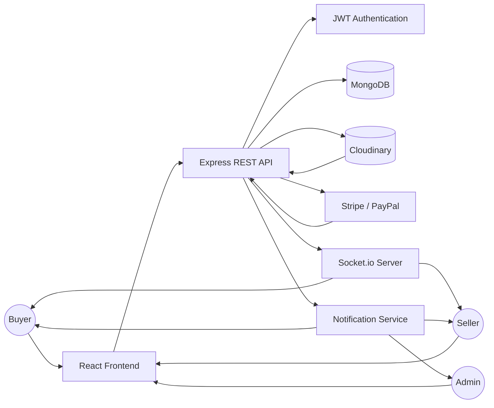

---

# Core Features

One of the defining characteristics of a successful marketplace is its ability to serve multiple types of users without compromising usability or security. Unlike a traditional online store, a multi-vendor platform must support independent business operations while maintaining a unified shopping experience for customers.

To achieve this, the platform implements a role-based architecture where Buyers, Sellers, and Administrators each have dedicated dashboards, permissions, and workflows. Every role interacts with the same backend services but experiences a customized interface tailored to its specific responsibilities.

The following sections explore each user role and the major functional modules that power the marketplace.

---

# Multi-Role User System

The application is built around a **Role-Based Access Control (RBAC)** model. Every authenticated user is assigned a specific role that determines which resources and operations they are permitted to access.

This approach improves both security and maintainability by preventing unauthorized access while keeping business logic organized.

The platform currently supports three primary user roles:

- Buyer
- Seller
- Administrator

Each role is designed around real-world marketplace workflows.

---

# Buyer

Buyers represent the primary customers of the marketplace. Their experience focuses on discovering products, communicating with sellers, completing secure purchases, and tracking orders from a centralized dashboard.

The application provides a seamless shopping journey that closely resembles modern commercial marketplaces.

## Account Management

Buyers can securely create an account, log in, and manage their personal information.

Available features include:

- User registration
- Secure login
- Profile updates
- Password management
- Address management
- Authentication persistence

JWT-based authentication ensures that protected resources remain accessible only to authorized users.

---

## Product Discovery

Finding products quickly is essential for any e-commerce platform.

Customers can browse products using multiple navigation methods including:

- Categories
- Search keywords
- Product collections
- Featured products
- Seller stores

Advanced filtering and sorting reduce the time required to locate relevant products.

Examples include:

- Price range
- Category
- Popularity
- Ratings
- New arrivals

---

## Wishlist Management

Customers can save products for future purchases without adding them to the shopping cart.

Wishlist functionality allows users to:

- Save favorite products
- Compare products later
- Track desired items
- Remove saved products

This feature improves long-term customer engagement and increases the likelihood of future purchases.

---

## Shopping Cart

The shopping cart provides a temporary workspace where customers prepare purchases before checkout.

Available actions include:

- Add products
- Remove products
- Update quantities
- Review pricing
- View shipping costs
- Calculate totals

Cart information remains synchronized with the user's account, providing a consistent experience across sessions.

---

## Secure Checkout

The checkout workflow has been designed to minimize friction while maintaining transaction security.

During checkout the platform performs:

- Address verification
- Order review
- Payment selection
- Payment processing
- Transaction verification
- Order generation

Only verified payments result in successful order creation.

---

## Order Management

Buyers have access to a dedicated order history where they can:

- View previous purchases
- Monitor order status
- Review payment information
- Contact sellers
- Track deliveries

Keeping order history centralized improves transparency and customer confidence.

---

## Product Reviews

After receiving products, customers can share their experiences by submitting ratings and written reviews.

Reviews contribute to:

- Marketplace transparency
- Product credibility
- Seller reputation
- Better purchasing decisions

The review system encourages trust between buyers and sellers.

---

## Real-Time Messaging

Communication plays an important role in online marketplaces.

Buyers can initiate conversations with sellers to:

- Ask product questions
- Clarify specifications
- Resolve order issues
- Discuss shipping details

Messages are delivered instantly through the WebSocket server, creating an interactive shopping experience.

---

# Seller

Sellers operate independent storefronts within the marketplace while sharing the underlying platform infrastructure.

Each seller receives a dedicated dashboard containing tools required to manage products, customers, and business performance.

---

## Store Management

Every seller maintains an independent business profile containing information such as:

- Store name
- Branding
- Contact information
- Business description
- Shop banner
- Logo

Store profiles help buyers identify trusted vendors and build long-term customer relationships.

---

## Product Management

Product management is one of the most frequently used areas of the seller dashboard.

Sellers can perform complete CRUD operations including:

- Create products
- Update products
- Delete products
- Upload images
- Modify pricing
- Manage inventory
- Update product descriptions

Each product belongs exclusively to its respective seller, ensuring proper data isolation.

---

## Inventory Management

Maintaining accurate inventory is essential for preventing overselling.

Inventory tools allow sellers to:

- Track stock levels
- Update available quantities
- Monitor inventory changes
- Prevent unavailable purchases

Automatic stock updates following successful orders help maintain consistency.

---

## Order Processing

Once customers complete purchases, sellers receive immediate access to order information.

Available order management capabilities include:

- View new orders
- Process pending orders
- Update shipping status
- Mark orders as delivered
- Monitor completed sales

These workflows ensure that customers remain informed throughout the fulfillment process.

---

## Revenue Tracking

The seller dashboard provides valuable business insights through revenue reporting.

Metrics include:

- Total sales
- Monthly revenue
- Pending earnings
- Completed orders
- Withdrawal history

This information enables sellers to monitor business growth over time.

---

## Customer Communication

The built-in messaging system allows sellers to communicate directly with customers.

Typical conversations include:

- Product inquiries
- Shipping updates
- Order clarification
- Customer support

Real-time communication improves customer satisfaction while reducing response delays.

---

## Seller Analytics

Data-driven decision making is critical for growing an online business.

The dashboard provides insights into:

- Product performance
- Sales trends
- Customer engagement
- Revenue growth
- Inventory movement

These analytics help sellers identify opportunities for improvement.

---

# Administrator

Administrators oversee marketplace operations while ensuring security, quality, and platform integrity.

Unlike buyers and sellers, administrators have access to system-wide information across all marketplace activities.

---

## User Management

Administrators can manage registered users across the platform.

Responsibilities include:

- View users
- Suspend accounts
- Remove users
- Monitor activity
- Resolve account issues

Centralized management improves operational efficiency.

---

## Seller Approval

To maintain marketplace quality, seller accounts undergo an approval process before they become active.

Administrators review:

- Store information
- Business details
- Marketplace compliance

This verification process helps reduce fraudulent activity.

---

## Product Moderation

Marketplace quality depends on accurate and appropriate product listings.

Administrators can:

- Review new products
- Remove prohibited listings
- Monitor seller activity
- Maintain marketplace standards

Moderation helps preserve customer trust.

---

## Reports & Analytics

The administration dashboard provides a comprehensive overview of platform performance.

Key metrics include:

- Total users
- Active sellers
- Product count
- Orders
- Revenue
- Marketplace growth

These reports assist in strategic decision-making and long-term planning.

---

## Platform Monitoring

Administrators continuously monitor the health of the platform by reviewing:

- User activity
- Order volume
- Transaction status
- Seller performance
- Marketplace statistics

Centralized monitoring enables proactive issue resolution.

---

# Product Management & Shopping

Managing products efficiently is fundamental to the success of any online marketplace. The platform provides sellers with intuitive tools for maintaining their catalogs while offering buyers an engaging shopping experience.

---

## Product Lifecycle

Every product follows a structured lifecycle from creation to purchase.

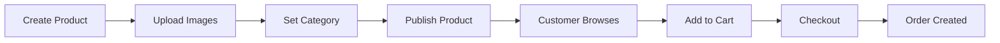

---

## Product CRUD

The platform supports complete product lifecycle management.

Sellers can:

- Create listings
- Update information
- Delete obsolete products
- Manage pricing
- Modify inventory
- Upload multiple images

This flexibility enables vendors to keep their catalogs accurate and up to date.

---

## Categories

Products are organized into categories that simplify navigation and improve discoverability.

Benefits include:

- Better browsing
- Improved search relevance
- Easier filtering
- Organized catalogs

---

## Product Images

Visual presentation is essential in e-commerce.

The application supports:

- Multiple product images
- High-quality uploads
- Cloud-based storage
- Fast image retrieval

Images are stored separately from application data, improving scalability and reducing server storage requirements.

---

## Product Reviews

Customers can leave ratings and written feedback after completing purchases.

Reviews help:

- Increase trust
- Improve product visibility
- Assist future buyers
- Reward high-performing sellers

---

## Search & Filtering

The marketplace includes powerful search capabilities designed to help customers quickly locate products.

Supported search options include:

- Product name
- Category
- Price
- Ratings
- Keywords

Filtering minimizes browsing time and enhances the shopping experience.

---

## Wishlist

Wishlist functionality enables users to bookmark products without initiating a purchase.

This encourages future engagement while helping customers compare products before making buying decisions.

---

## Shopping Cart

The shopping cart calculates pricing dynamically and allows users to review purchases before payment.

Cart operations include:

- Quantity adjustments
- Product removal
- Pricing summaries
- Shipping calculations

---

## Checkout

The checkout process combines simplicity with security.

The workflow includes:

1. Review order
2. Select payment method
3. Verify payment
4. Create order
5. Update inventory
6. Send confirmations

This structured approach minimizes transaction errors while improving customer confidence.

---

# Brand Value Propositions

Beyond technical implementation, the platform delivers meaningful business value through thoughtful architecture and engineering practices.

| Area | Value Delivered |
|------|-----------------|
| **Scalability** | Modular architecture supports future growth without major refactoring. |
| **Maintainability** | Clear separation of concerns keeps the codebase organized and easy to extend. |
| **Security** | JWT authentication, RBAC, encrypted passwords, and secure payment verification protect sensitive data. |
| **Performance** | Optimized queries, efficient state management, and cloud-hosted media improve responsiveness. |
| **Reliability** | Consistent API design and centralized business logic ensure predictable application behavior. |
| **User Experience** | Dedicated dashboards, intuitive navigation, and responsive interfaces provide a seamless experience for all user roles. |
| **Developer Experience** | Organized project structure, reusable components, and modular APIs simplify collaboration and future enhancements. |
| **Business Growth** | Multi-vendor support enables marketplace expansion without significant architectural changes. |

---

# Payment Processing

A secure and reliable payment workflow is one of the most critical components of any e-commerce platform. Since financial transactions directly affect both customer trust and seller revenue, the application separates payment processing from core business logic while ensuring every transaction is verified before an order is finalized.

The platform integrates trusted third-party payment providers to support multiple payment methods, giving customers flexibility while maintaining high security standards.

Rather than assuming that a successful payment request automatically creates an order, the backend validates every payment response before updating inventory, generating order records, and notifying the relevant users.

This approach minimizes data inconsistencies and helps protect against incomplete or fraudulent transactions.

---

## Supported Payment Methods

To accommodate different customer preferences, the marketplace supports multiple payment options.

| Payment Method | Purpose | Benefits |
|---------------|----------|----------|
| **Stripe** | Secure card payments | Supports debit cards, credit cards, and international transactions. |
| **PayPal** | Digital wallet | Offers a familiar checkout experience and additional payment flexibility. |

Supporting more than one payment gateway improves accessibility and reduces checkout abandonment.

---

## Payment Workflow

Every purchase follows a carefully structured lifecycle to ensure transactional integrity.

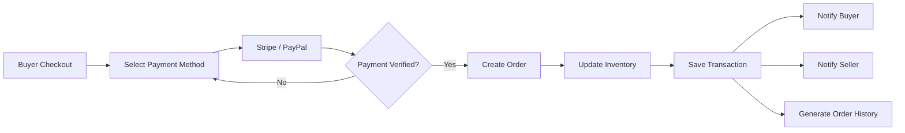

---

## Payment Verification

The backend performs server-side verification before completing any purchase.

Verification includes:

- Payment status validation
- Transaction confirmation
- Order amount verification
- Customer identification
- Duplicate transaction prevention

Only verified transactions proceed to order creation.

This design prevents accidental order generation when payments fail or are interrupted.

---

## Order Confirmation

Once payment has been verified successfully, the system performs several operations automatically.

These include:

- Creating the order record
- Updating product inventory
- Associating the order with the buyer
- Associating purchased products with the seller
- Recording payment information
- Triggering confirmation notifications

Automating these steps ensures data consistency while reducing manual intervention.

---

## Transaction Management

Every successful purchase creates a transaction record that can later be referenced for customer support, reporting, and seller analytics.

Transaction management enables:

- Payment history
- Revenue tracking
- Seller earnings
- Order reconciliation
- Financial reporting

Maintaining a dedicated transaction history also simplifies future enhancements such as refunds and financial audits.

---

## Refund Strategy

Although refund policies vary by business, the application architecture has been designed to support refund workflows.

A typical refund lifecycle would include:

1. Customer requests refund.
2. Seller reviews the request.
3. Administrator intervenes when necessary.
4. Payment gateway processes the refund.
5. Order status is updated.
6. Customer receives confirmation.

Separating refund logic from payment processing allows future extensions without disrupting existing checkout functionality.

---

# Real-Time Messaging

Communication between buyers and sellers significantly improves the overall marketplace experience. Customers frequently require additional information before making a purchase, while sellers benefit from responding quickly to inquiries and providing order updates.

To support instant communication, the platform includes a dedicated real-time messaging system powered by **Socket.io**, enabling bidirectional communication over persistent WebSocket connections.

Unlike traditional HTTP polling, which repeatedly requests updates from the server, WebSockets maintain an open connection that allows both the client and server to exchange information instantly.

---

## Messaging Architecture

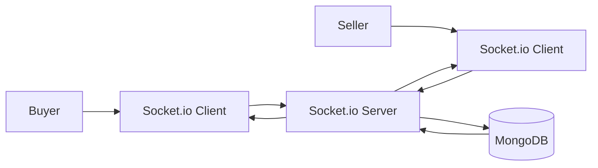

---

## Messaging Features

The communication module provides functionality commonly found in modern marketplace platforms.

Supported capabilities include:

- Buyer-to-seller conversations
- Instant message delivery
- Persistent conversation history
- Online user detection
- Conversation synchronization
- Live notifications
- Event-based communication

Messages appear immediately without requiring page refreshes, creating a more natural communication experience.

---

## Online Presence

The Socket.io server maintains a list of active connections, allowing users to determine whether another participant is currently online.

Benefits include:

- Faster customer support
- Immediate responses
- Improved engagement
- Better purchasing confidence

Real-time presence contributes to a more interactive marketplace.

---

## Event-Driven Communication

Instead of relying on repeated API requests, the application responds to specific events generated by users.

Typical events include:

- User connected
- User disconnected
- Message sent
- Message received
- Conversation created
- Notification triggered

This event-driven architecture minimizes unnecessary network traffic while improving responsiveness.

---

## Notification Flow

Messaging events automatically trigger notification updates.

Examples include:

- New chat message
- Order confirmation
- Shipping updates
- Product inquiries
- Seller responses

Users receive timely information without manually checking for updates.

---

# Seller Dashboard

The Seller Dashboard serves as the operational hub for every vendor on the platform. It consolidates business management tools into a single interface, enabling sellers to monitor performance, manage inventory, process orders, and communicate with customers efficiently.

Instead of navigating multiple pages, sellers gain immediate access to the information required to run their online business.

---

## Dashboard Overview

The dashboard provides a high-level summary of store performance through organized widgets and reports.

Common metrics include:

- Total products
- Active orders
- Completed orders
- Monthly sales
- Total revenue
- Pending withdrawals
- Customer messages

These insights help sellers understand the overall health of their business at a glance.

---

## Revenue Tracking

Revenue monitoring enables sellers to evaluate business performance over time.

The dashboard tracks:

- Daily earnings
- Weekly revenue
- Monthly sales
- Lifetime revenue
- Average order value

Historical reporting helps identify growth trends and seasonal purchasing behavior.

---

## Order Management

Order management tools simplify the fulfillment process by organizing purchases according to their current status.

Typical order states include:

- Pending
- Confirmed
- Processing
- Shipped
- Delivered
- Cancelled

Sellers can update order status, keeping customers informed throughout the fulfillment lifecycle.

---

## Inventory Monitoring

Accurate inventory tracking is essential for preventing overselling and maintaining customer satisfaction.

The dashboard provides visibility into:

- Available stock
- Low-stock products
- Out-of-stock items
- Inventory updates

These insights allow sellers to replenish inventory proactively.

---

## Product Performance

Understanding how products perform helps sellers make informed business decisions.

Performance indicators may include:

- Product views
- Purchases
- Ratings
- Customer reviews
- Sales volume

These metrics enable vendors to optimize pricing, marketing, and inventory strategies.

---

## Customer Management

Maintaining strong customer relationships is essential for long-term marketplace success.

The dashboard enables sellers to:

- View customer information
- Respond to inquiries
- Monitor conversations
- Track purchase history

Efficient customer management improves satisfaction and encourages repeat business.

---

## Sales Analytics

Analytical reporting transforms raw sales data into actionable insights.

Common reports include:

- Revenue trends
- Best-selling products
- Sales by category
- Order distribution
- Customer activity

These reports support data-driven decision-making and strategic planning.

---

# API Architecture

The backend exposes a structured collection of RESTful APIs that serve as the communication layer between the frontend, database, and external services.

Rather than embedding business logic directly into route definitions, the application follows a modular architecture where responsibilities are separated into routes, controllers, middleware, and data models.

This organization improves readability, simplifies maintenance, and supports future scalability.

---

## RESTful Design Principles

The API follows REST conventions to ensure consistency and predictability.

Key characteristics include:

- Resource-oriented endpoints
- Standard HTTP methods
- Consistent response structures
- Stateless communication
- JSON data exchange

Typical resources include:

- Authentication
- Users
- Sellers
- Products
- Orders
- Reviews
- Conversations
- Messages
- Payments

---

## Route Organization

Endpoints are grouped according to business domains rather than application pages.

Example structure:

```text
/routes
│
├── authRoutes.js
├── userRoutes.js
├── sellerRoutes.js
├── productRoutes.js
├── orderRoutes.js
├── paymentRoutes.js
├── conversationRoutes.js
├── messageRoutes.js
└── adminRoutes.js
```

This modular organization improves navigation and simplifies feature expansion.

---

## Controllers

Controllers act as the entry point for incoming requests.

Their responsibilities include:

- Receiving client requests
- Validating request data
- Calling business logic
- Returning standardized responses

Keeping controllers lightweight improves code readability and testability.

---

## Middleware

Middleware provides reusable request-processing functionality before requests reach business logic.

Examples include:

- JWT authentication
- Authorization
- File upload handling
- Error handling
- Request validation
- Logging

This layered approach avoids code duplication while maintaining consistency across the application.

---

## Authentication & Authorization

Protected endpoints require valid authentication before access is granted.

Authorization middleware ensures that:

- Buyers access only customer resources.
- Sellers manage only their own stores.
- Administrators retain platform-wide permissions.

This Role-Based Access Control (RBAC) model strengthens application security.

---

## Validation

Incoming requests are validated before interacting with the database.

Validation checks include:

- Required fields
- Data formats
- Invalid values
- Missing parameters

Server-side validation protects application integrity even when client-side validation is bypassed.

---

## Error Handling

The API returns consistent error responses using standardized HTTP status codes.

Typical responses include:

| Status Code | Meaning |
|-------------|---------|
| **200** | Request successful |
| **201** | Resource created successfully |
| **400** | Invalid request |
| **401** | Authentication required |
| **403** | Access denied |
| **404** | Resource not found |
| **500** | Internal server error |

Consistent responses simplify frontend error handling and improve the developer experience.

---

## Pagination & Filtering

To improve performance when handling large datasets, list endpoints support pagination and filtering.

Typical capabilities include:

- Page numbers
- Result limits
- Category filters
- Keyword search
- Price filtering
- Sorting

These features reduce response size while improving usability.

---

## API Versioning

Although the current implementation exposes a single API version, the modular architecture makes future versioning straightforward.

Versioned endpoints (e.g., `/api/v1/`) can be introduced without disrupting existing clients, ensuring backward compatibility as the platform evolves.

---

# Technology Stack

Selecting the right technologies is fundamental to building a scalable, maintainable, and high-performance marketplace. Rather than choosing technologies solely based on popularity, every tool used in this project solves a specific engineering problem—from managing application state and handling authentication to processing payments and enabling real-time communication.

The platform follows the **MERN (MongoDB, Express.js, React, Node.js)** architecture, complemented by additional libraries and services that improve security, developer productivity, and user experience.

---

# Backend Technology Stack

The backend serves as the application's core, handling business logic, authentication, payment verification, order processing, inventory management, and communication with external services.

| Technology | Purpose | Why It Was Chosen |
|------------|---------|-------------------|
| **Node.js** | JavaScript Runtime | Event-driven architecture with excellent performance for I/O-intensive applications. |
| **Express.js** | Web Framework | Lightweight framework for building scalable RESTful APIs. |
| **MongoDB** | NoSQL Database | Flexible document database well-suited for marketplace data models. |
| **Mongoose** | ODM | Schema validation, model relationships, middleware, and query abstraction. |
| **JWT** | Authentication | Stateless and secure user authentication. |
| **bcryptjs** | Password Hashing | Encrypts user passwords before database storage. |
| **Cookie Parser** | Cookie Management | Parses and manages authentication cookies. |
| **CORS** | Cross-Origin Resource Sharing | Enables secure communication between frontend and backend. |
| **Multer** | File Uploads | Handles multipart/form-data for product image uploads. |
| **Cloudinary** | Cloud Media Storage | Stores and optimizes uploaded product images. |
| **Nodemailer** | Email Service | Sends transactional emails and notifications. |
| **Socket.io** | WebSocket Communication | Enables real-time messaging and live updates. |
| **Stripe SDK** | Card Payments | Secure payment processing and transaction verification. |
| **PayPal SDK** | Digital Wallet Payments | Alternative payment option for customers. |

---

## Backend Architecture

The backend follows a modular architecture where each layer has a clearly defined responsibility.

```text
Backend
│
├── Routes
│
├── Controllers
│
├── Middleware
│
├── Models
│
├── Utilities
│
├── Services
│
└── Configuration
```

This organization keeps the codebase maintainable while making it easier to extend the application with new features.

---

## Why Express.js?

Express.js provides a lightweight yet powerful framework for building RESTful APIs.

Its middleware architecture enables reusable implementations for:

- Authentication
- Authorization
- Validation
- Error handling
- File uploads
- Logging

Keeping these concerns separate improves code quality and reduces duplication.

---

## Database Integration

MongoDB stores marketplace data using flexible document structures.

Examples include:

- Users
- Sellers
- Products
- Orders
- Conversations
- Messages
- Reviews
- Events
- Withdrawals

Mongoose simplifies interaction with MongoDB by providing:

- Schemas
- Validation
- Middleware hooks
- Population
- Query builders

This combination balances flexibility with data consistency.

---

# Frontend Technology Stack

The frontend delivers a responsive Single Page Application (SPA) for Buyers, Sellers, and Administrators.

React's component-based architecture allows the interface to remain modular and reusable while supporting complex business workflows.

| Technology | Purpose | Benefits |
|------------|---------|----------|
| **React** | User Interface | Reusable components and efficient rendering. |
| **Redux Toolkit** | State Management | Centralized application state with simplified Redux configuration. |
| **React Router** | Routing | Client-side navigation without page reloads. |
| **Axios** | HTTP Client | Simplifies API communication and request management. |
| **Material UI** | Component Library | Professional and responsive UI components. |
| **React Toastify** | Notifications | Displays success, warning, and error messages. |
| **Socket.io Client** | Real-Time Communication | Connects the frontend to the WebSocket server. |
| **Stripe React SDK** | Payments | Integrates Stripe Checkout securely. |
| **PayPal React SDK** | Payments | Enables PayPal checkout within React. |

---

## Component-Based Development

React encourages reusable UI development through independent components.

Examples include:

- Navigation bars
- Product cards
- Shopping cart
- Dashboard widgets
- Review components
- Chat windows
- Order tables
- Seller analytics
- Forms
- Buttons

Reusable components improve consistency while reducing duplicated code.

---

## State Management

Marketplace applications require shared data across many pages.

Redux Toolkit manages global state including:

- Authentication
- User profile
- Seller information
- Products
- Shopping cart
- Wishlist
- Orders
- Notifications

Centralized state management reduces unnecessary API requests and simplifies application logic.

---

## Routing

React Router enables seamless navigation between application pages.

Protected routes ensure only authenticated users can access restricted resources.

Examples include:

- Buyer dashboard
- Seller dashboard
- Admin dashboard
- Checkout
- Orders
- Product management

---

# File & Media Handling

Product images play a critical role in online shopping. The platform separates media storage from application logic to improve scalability, performance, and deployment flexibility.

Rather than storing images directly on the application server, media files are uploaded to **Cloudinary**, while MongoDB stores only the corresponding image URLs.

---

## Image Upload Workflow

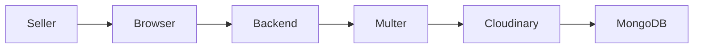

---

## Image Processing Pipeline

The upload process consists of several validation stages before media is stored.

Steps include:

1. File selection
2. Upload request
3. File validation
4. Multer processing
5. Cloudinary upload
6. Image URL generation
7. MongoDB update

Separating these stages simplifies debugging while ensuring invalid uploads never reach permanent storage.

---

## Media Security

The upload pipeline includes several safeguards.

Validation includes:

- Accepted file formats
- Upload size restrictions
- Server-side verification
- Controlled upload endpoints

These measures reduce the risk of malicious file uploads.

---

## Benefits of Cloud Storage

Using Cloudinary provides several advantages.

- Reduced server storage
- Faster image delivery
- Automatic optimization
- Improved scalability
- Better reliability
- Easier maintenance

This architecture closely resembles production marketplace platforms.

---

# Real-Time Communication

One of the most interactive features of the application is its WebSocket-based messaging system.

Unlike traditional request-response communication, Socket.io enables persistent bidirectional communication between connected clients.

This architecture supports instant messaging, online presence detection, and live notifications.

---

## Socket.io Architecture

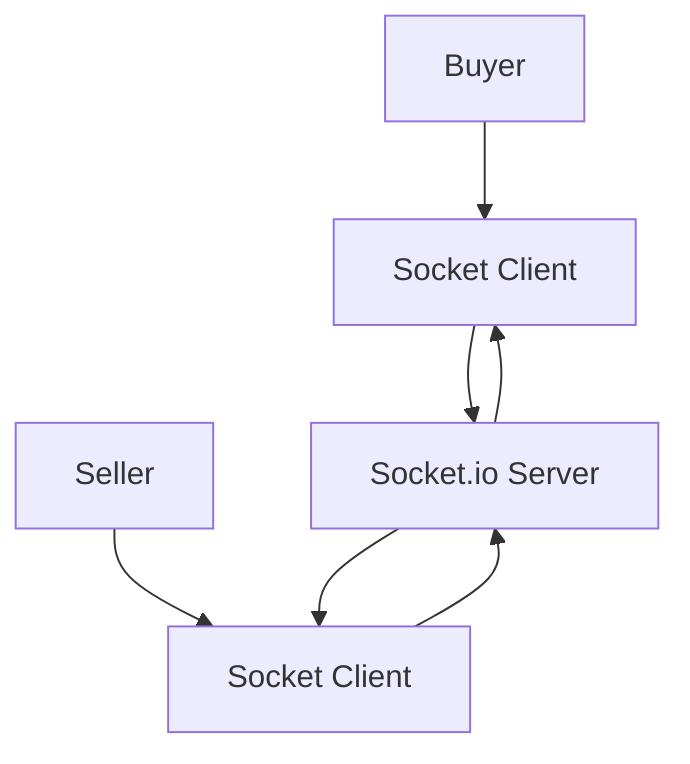

---

## Real-Time Events

The application broadcasts several event types.

Examples include:

- User connected
- User disconnected
- Message received
- Message delivered
- Conversation created
- Notification triggered
- Order updates

Because only affected users receive broadcasts, unnecessary network traffic is minimized.

---

## Advantages of WebSockets

Compared with HTTP polling, WebSockets provide:

- Lower latency
- Fewer API requests
- Better scalability
- Reduced server load
- Instant updates
- Improved customer engagement

These improvements significantly enhance the user experience.

---

# Development & Deployment Tools

Building a production-ready application requires more than writing code. Development tools help maintain code quality, simplify collaboration, and streamline deployment.

| Tool | Purpose |
|------|---------|
| **Git** | Version control and source history |
| **GitHub** | Repository hosting and collaboration |
| **npm** | Package management |
| **Postman** | REST API testing |
| **Visual Studio Code** | Primary development environment |

---

## Version Control

Git enables collaborative software development by tracking every modification made to the codebase.

Key benefits include:

- Branch management
- Commit history
- Feature isolation
- Code reviews
- Easy rollback
- Collaborative workflows

GitHub further enhances collaboration through pull requests, issue tracking, and project documentation.

---

## API Testing

Every API endpoint is tested independently before frontend integration.

Typical test scenarios include:

- User authentication
- Product CRUD operations
- Seller management
- Order creation
- Payment verification
- Review submission
- Messaging
- Administrative actions

Independent API testing improves backend reliability and simplifies debugging.

---

## Environment Configuration

Sensitive configuration values are stored separately from application code using environment variables.

Examples include:

- Database connection strings
- JWT secrets
- Stripe API keys
- PayPal credentials
- Cloudinary configuration
- Email service credentials

Separating configuration from source code improves security and deployment flexibility.

---

# Engineering Highlights

Several architectural decisions contribute to the maintainability and scalability of the platform.

### Modular Architecture

Features are organized into independent modules that encapsulate related functionality.

Benefits include:

- Easier maintenance
- Cleaner code organization
- Faster onboarding
- Simplified feature development

---

### Separation of Concerns

Each layer of the application has a single responsibility.

- React handles presentation.
- Express manages business logic.
- MongoDB stores application data.
- Cloudinary manages media.
- Stripe and PayPal process payments.
- Socket.io enables live communication.

This separation reduces coupling while improving extensibility.

---

### Scalable Foundation

The architecture has been designed with future expansion in mind.

Potential enhancements include:

- Microservice migration
- Advanced analytics
- Recommendation engines
- Multi-language support
- Multi-currency support
- Mobile applications
- AI-powered product recommendations
- Shipment tracking integrations

Because the current implementation follows modular principles, these features can be introduced with minimal disruption.

---

# Challenges & Solutions

Building a production-ready multi-vendor marketplace involves much more than implementing CRUD operations. As the application evolved, several engineering challenges emerged across authentication, state management, payment processing, database performance, image handling, and real-time communication.

Rather than applying temporary fixes, each challenge was addressed using scalable architectural patterns that improve maintainability and prepare the platform for future growth.

The following sections highlight some of the most significant technical challenges encountered during development and explain how they were resolved.

---

# Challenge 1 — Managing Complex Application State

## Problem

As new features such as authentication, shopping carts, wishlists, seller dashboards, messaging, and order management were introduced, sharing data between unrelated React components became increasingly difficult.

Passing props through multiple component levels (prop drilling) reduced readability and complicated maintenance.

---

## Cause

Marketplace applications naturally require many pages to access shared data simultaneously.

Examples include:

- Logged-in user
- Shopping cart
- Seller information
- Product catalog
- Wishlist
- Orders
- Notifications

Managing these independently resulted in duplicated logic and unnecessary API requests.

---

## Solution

Redux Toolkit was introduced as the centralized state management solution.

The global store was divided into logical slices, including:

- Authentication
- User
- Seller
- Products
- Cart
- Wishlist
- Orders
- Notifications

Only components that depend on a specific slice re-render when state changes, improving performance and maintainability.

---

## Result

Benefits achieved include:

- Cleaner component hierarchy
- Predictable state updates
- Reduced prop drilling
- Easier debugging
- Better scalability

---

# Challenge 2 — Secure Authentication & Authorization

## Problem

The platform supports multiple user roles, each with different permissions and responsibilities.

Allowing unrestricted API access could expose sensitive seller or administrative operations.

---

## Cause

Without proper authorization, malicious users could manipulate protected resources or access privileged functionality.

---

## Solution

The authentication system combines several security mechanisms:

- JWT authentication
- Password hashing with bcrypt
- Protected routes
- Role-Based Access Control (RBAC)
- Authentication middleware
- HTTP-only cookies

Every protected API validates the user's identity before executing business logic.

---

## Result

The authentication system now provides:

- Secure user sessions
- Role isolation
- Protected administrative resources
- Secure seller operations
- Improved application security

---

# Challenge 3 — Payment Integration

## Problem

Handling online payments requires communication with external providers while maintaining consistent application data.

Creating an order before payment verification could lead to invalid transactions.

---

## Cause

Network failures, cancelled payments, or interrupted transactions can leave the database in an inconsistent state.

---

## Solution

The payment workflow was redesigned to ensure order creation occurs **only after successful server-side payment verification**.

The backend now follows this sequence:

1. Customer initiates payment.
2. Payment gateway processes the transaction.
3. Backend verifies the payment.
4. Order is created.
5. Inventory is updated.
6. Notifications are sent.

---

## Result

This approach provides:

- Reliable order creation
- Consistent transaction records
- Accurate inventory
- Improved financial integrity

---

# Challenge 4 — Real-Time Synchronization

## Problem

Customers expect instant communication with sellers.

Traditional HTTP polling introduced unnecessary network traffic and delayed updates.

---

## Cause

Repeated API requests increase server load while reducing responsiveness.

---

## Solution

Socket.io was integrated to establish persistent WebSocket connections between connected users.

The messaging system now broadcasts events only to affected participants.

Supported events include:

- New messages
- User connected
- User disconnected
- Notifications
- Conversation updates

---

## Result

Real-time communication now provides:

- Instant messaging
- Lower latency
- Reduced polling
- Better customer engagement
- Faster seller responses

---

# Challenge 5 — Image Management

## Problem

Product images represent one of the largest storage requirements within the platform.

Saving media directly on the application server complicates deployment and scalability.

---

## Cause

Large image collections consume storage, increase backup complexity, and reduce deployment flexibility.

---

## Solution

Images are uploaded through **Multer** before being transferred to **Cloudinary**.

Only image URLs are stored in MongoDB.

---

## Result

Advantages include:

- Reduced server storage
- Faster image delivery
- Easier backups
- Improved scalability
- Better availability

---

# Challenge 6 — Database Performance

## Problem

As the number of products and orders grows, database queries become increasingly expensive.

---

## Cause

Searching large collections without optimization leads to slower response times.

---

## Solution

Several optimization strategies were implemented.

These include:

- Indexed search fields
- Referenced relationships
- Efficient query filters
- Pagination
- Sorting
- Lean database queries where appropriate

---

## Result

The application maintains responsive performance even as marketplace data grows.

---

# Challenge 7 — API Security

## Problem

Public APIs are vulnerable to malicious requests, unauthorized access, and invalid data.

---

## Cause

Client-side validation alone cannot guarantee application security.

---

## Solution

Server-side middleware validates every request before business logic executes.

Validation includes:

- Authentication
- Authorization
- Required fields
- Data types
- Invalid values
- Permission checks

---

## Result

The API remains secure while providing consistent responses to clients.

---

# Engineering Summary

| Challenge | Solution | Result |
|-----------|----------|--------|
| State Management | Redux Toolkit | Predictable application state |
| Authentication | JWT + RBAC | Secure user access |
| Payments | Server-side verification | Reliable transactions |
| Messaging | Socket.io | Instant communication |
| Image Storage | Cloudinary | Scalable media management |
| Database Performance | Indexing & Pagination | Faster queries |
| API Security | Middleware Validation | Improved protection |

---

# Database Design

The database has been designed around the core business entities required to operate a multi-vendor marketplace.

Rather than storing all information within a single collection, related entities are normalized where appropriate and connected through document references.

This design improves scalability, reduces duplication, and simplifies long-term maintenance.

---

# Primary Entities

The platform revolves around several interconnected collections.

| Entity | Description |
|---------|-------------|
| **User** | Stores buyer and administrator accounts. |
| **Seller** | Represents marketplace vendors and storefront information. |
| **Product** | Product catalog including pricing, inventory, and images. |
| **Order** | Customer purchases and order status. |
| **Conversation** | Buyer-seller chat sessions. |
| **Message** | Individual chat messages. |
| **Review** | Product ratings and written feedback. |
| **Event** | Seller promotions and marketplace campaigns. |
| **Withdrawal** | Seller payout requests and earnings history. |

---

# Entity Relationships

The relationships between collections closely mirror real-world marketplace operations.

Examples include:

- One seller owns many products.
- One buyer can place many orders.
- Products receive multiple reviews.
- Conversations contain multiple messages.
- Sellers create promotional events.
- Sellers submit withdrawal requests.

Using references rather than deeply nested documents helps maintain flexibility as the platform evolves.

---

# Database Normalization

Although MongoDB is a document database, careful normalization reduces unnecessary duplication.

Examples include:

- Separate collections for users and sellers
- Independent order documents
- Dedicated review collection
- Standalone conversations
- Separate message records

This structure minimizes update anomalies while keeping documents manageable.

---

# Indexing Strategy

Efficient indexing significantly improves query performance.

Common indexed fields include:

- User email
- Seller ID
- Product category
- Product name
- Order status
- Creation date
- Conversation participants

Indexes reduce lookup times and improve filtering across large datasets.

---

# Performance Considerations

Several database optimization strategies contribute to application performance.

### Efficient Queries

Database requests retrieve only the fields required by the client.

---

### Pagination

Large collections are divided into manageable pages, reducing payload size and improving response times.

---

### Filtering

Search operations use indexed fields whenever possible.

---

### Sorting

Products and orders can be sorted efficiently without requiring expensive client-side processing.

---

### Referenced Documents

Document references reduce duplication while preserving flexibility.

---

# Entity Relationship Diagram

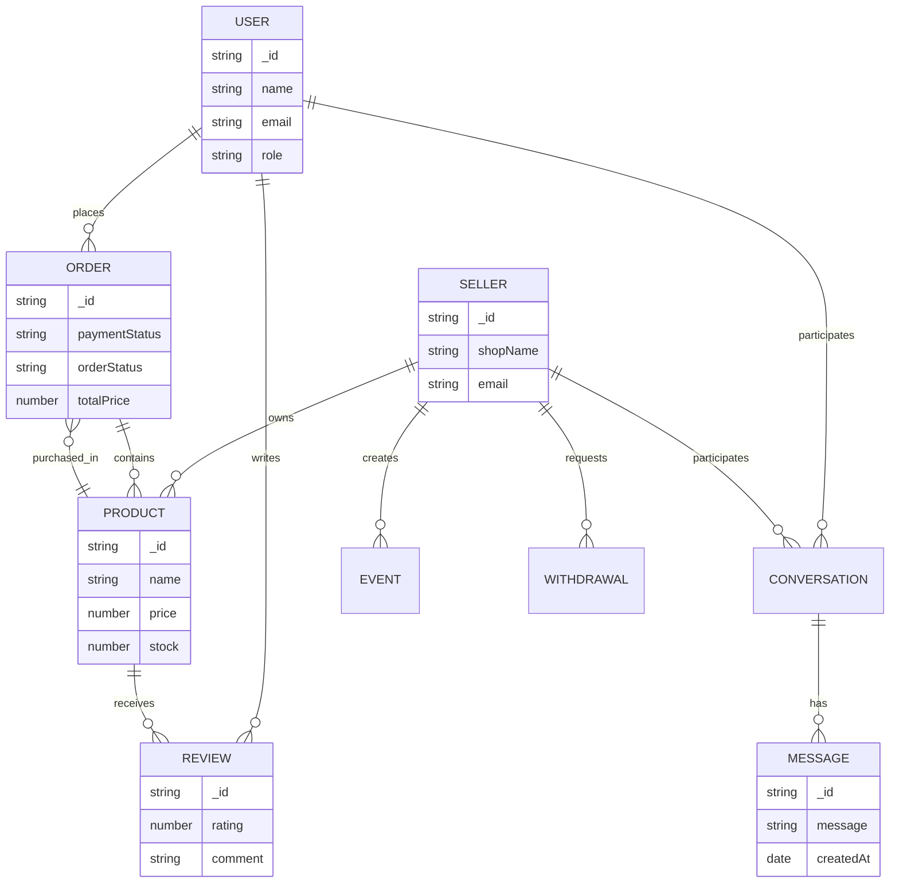

---

# Database Design Highlights

The database architecture was designed with long-term scalability in mind.

Key characteristics include:

- Flexible document modeling
- Efficient indexing strategy
- Minimal data duplication
- Scalable relationships
- Optimized search performance
- Maintainable schema organization

These design decisions allow the marketplace to grow while maintaining consistent performance and simplifying future feature development.

---

# Application Flow

A marketplace application involves far more than displaying products and processing payments. Behind every successful purchase is a coordinated sequence of authentication, product discovery, inventory validation, payment verification, order management, notifications, and fulfillment.

The platform follows a structured workflow where each service has a clearly defined responsibility. This separation of concerns improves reliability, simplifies debugging, and ensures every transaction is processed consistently.

The following diagram illustrates the complete lifecycle of a customer order—from user authentication to successful delivery.

---

## End-to-End Marketplace Workflow

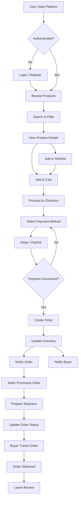

---

# Buyer Flow

The buyer journey is designed to be intuitive, responsive, and secure. Every stage—from registration to leaving a product review—has been optimized to minimize friction while providing transparency throughout the purchasing process.

Rather than overwhelming users with unnecessary complexity, the application presents a streamlined experience that closely resembles modern commercial marketplaces.

---

## 1. Account Registration

The buyer begins by creating an account using a secure registration form.

Information collected includes:

- Name
- Email address
- Password

Passwords are hashed before storage, ensuring sensitive information is never saved in plain text.

After successful registration, the buyer can immediately access authenticated features.

---

## 2. Authentication

Returning users log in using their registered credentials.

The authentication service:

- Validates credentials
- Generates a JWT
- Establishes the user session
- Grants access to protected resources

Authenticated users retain access to personalized features such as wishlists, orders, and messaging.

---

## 3. Product Discovery

Once authenticated, buyers can explore the marketplace using several navigation methods.

Supported options include:

- Browse by category
- Search by keyword
- Filter by price
- Sort by popularity
- View featured products

These capabilities help users locate relevant products quickly, even as the marketplace grows.

---

## 4. Product Evaluation

Each product page provides comprehensive information to support purchasing decisions.

Typical information includes:

- Product images
- Description
- Pricing
- Available inventory
- Seller information
- Customer reviews
- Average rating

This level of detail reduces uncertainty and increases customer confidence.

---

## 5. Wishlist & Shopping Cart

If a customer is not yet ready to purchase, products can be saved to a wishlist.

When ready to buy, products are added to the shopping cart where buyers can:

- Adjust quantities
- Remove items
- Review pricing
- Confirm shipping details

The cart acts as a temporary workspace before checkout.

---

## 6. Secure Checkout

The checkout process guides buyers through a structured payment workflow.

Steps include:

1. Review selected items
2. Confirm delivery address
3. Choose payment method
4. Complete payment
5. Receive confirmation

Only successful transactions generate new orders.

---

## 7. Order Tracking

Following checkout, buyers gain access to detailed order information.

Order history displays:

- Order number
- Purchased products
- Payment status
- Shipping status
- Delivery updates

Real-time status changes improve transparency throughout the fulfillment process.

---

## 8. Reviews & Ratings

After receiving products, buyers can provide feedback through ratings and written reviews.

Reviews contribute to:

- Marketplace transparency
- Seller credibility
- Product quality
- Customer trust

---

## Buyer Journey Diagram

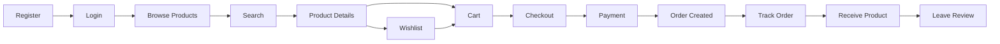

---

# Seller Flow

Sellers operate independent businesses within the marketplace while benefiting from the platform's shared infrastructure.

The seller workflow has been designed to simplify product management, order fulfillment, customer communication, and business analytics.

---

## 1. Seller Registration

Prospective vendors register by submitting their business information.

The onboarding process captures:

- Store name
- Contact information
- Business details
- Profile images

Seller accounts remain inactive until approved by an administrator.

---

## 2. Seller Approval

Administrators review seller applications to maintain marketplace quality.

Approved sellers receive access to the Seller Dashboard.

---

## 3. Store Management

Once approved, sellers configure their storefront.

Customization options include:

- Store banner
- Logo
- Description
- Contact details

This creates a recognizable identity within the marketplace.

---

## 4. Product Publishing

Sellers build their product catalog using the product management system.

For each product they can:

- Upload images
- Set pricing
- Define inventory
- Select categories
- Write descriptions

Products become available to buyers immediately after publication.

---

## 5. Order Fulfillment

When customers place orders, sellers receive immediate notifications.

Typical workflow:

- View order
- Confirm availability
- Prepare shipment
- Update order status
- Complete delivery

Customers receive status updates throughout the fulfillment process.

---

## 6. Customer Communication

Built-in messaging enables direct communication between sellers and buyers.

Common conversations include:

- Product inquiries
- Shipping updates
- Order clarification
- Customer support

---

## 7. Revenue & Analytics

The Seller Dashboard continuously tracks business performance.

Metrics include:

- Revenue
- Orders
- Product performance
- Inventory levels
- Customer activity

These reports support informed business decisions.

---

## Seller Workflow Diagram

```mermaid
flowchart LR

A[Seller Registration]

B[Admin Approval]

C[Dashboard Access]

D[Create Store]

E[Add Products]

F[Publish Products]

G[Receive Orders]

H[Process Orders]

I[Ship Products]

J[Receive Payment]

K[View Analytics]

A --> B

B --> C

C --> D

D --> E

E --> F

F --> G

G --> H

H --> I

I --> J

J --> K
```

---

# Administrator Flow

Administrators ensure the marketplace remains secure, reliable, and compliant with platform policies.

Rather than participating directly in buying or selling, administrators oversee the entire ecosystem.

---

## 1. Platform Monitoring

Administrators begin by reviewing marketplace activity through a centralized dashboard.

High-level metrics include:

- Active users
- Registered sellers
- Products
- Orders
- Revenue

These metrics provide an immediate overview of platform health.

---

## 2. User Management

Administrators manage user accounts by:

- Viewing profiles
- Suspending accounts
- Resolving disputes
- Removing malicious users

Role-based permissions prevent unauthorized access to administrative functions.

---

## 3. Seller Verification

Every new seller application undergoes review before activation.

Verification helps:

- Reduce fraud
- Improve marketplace quality
- Protect buyers

---

## 4. Product Moderation

Administrators monitor marketplace listings to ensure compliance with platform policies.

Moderation activities include:

- Reviewing reported products
- Removing prohibited listings
- Monitoring seller behavior

---

## 5. Marketplace Reports

Administrative reports provide insights into long-term business performance.

Typical reports include:

- Revenue growth
- Order trends
- Seller performance
- Customer activity
- Marketplace engagement

---

## 6. Platform Maintenance

Ongoing maintenance ensures long-term reliability.

Responsibilities include:

- Monitoring system health
- Reviewing logs
- Managing configurations
- Supporting users

---

## Administrator Workflow Diagram

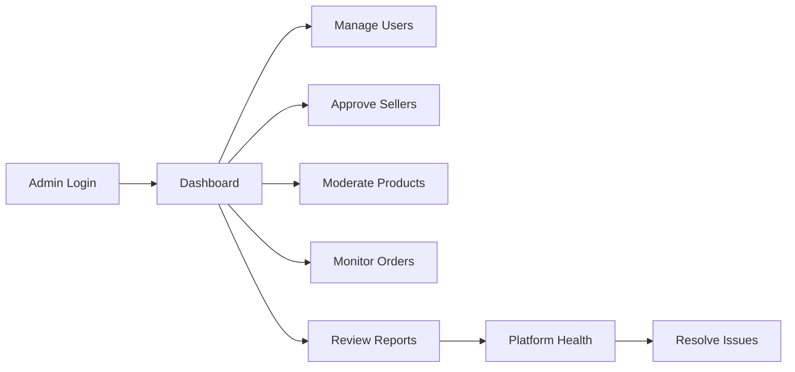

---

# Workflow Design Principles

The workflows implemented throughout the platform follow several core software engineering principles:

| Principle | Implementation |
|-----------|----------------|
| **Consistency** | Every user follows predictable navigation and interaction patterns. |
| **Security** | Authentication and authorization are enforced at each protected step. |
| **Reliability** | Payment verification precedes order creation to maintain data integrity. |
| **Scalability** | Modular workflows allow new features to be introduced with minimal disruption. |
| **Transparency** | Buyers and sellers receive timely updates through notifications and order tracking. |
| **Maintainability** | Clearly defined business processes simplify future enhancements and debugging. |

These workflow designs ensure that the platform remains intuitive for users while providing a robust foundation for future growth.

---

# Best Practices

Developing a production-ready marketplace extends beyond implementing features. A maintainable and scalable application requires consistent engineering practices that ensure security, reliability, performance, and an excellent user experience.

Throughout this project, industry-standard practices were adopted to build an application that is easy to maintain, secure by design, and capable of supporting future growth.

---

# Authentication & Security

Security is one of the most critical aspects of any e-commerce platform. Since the application handles user accounts, payments, personal information, and seller operations, multiple layers of protection have been implemented to reduce potential attack vectors.

Rather than relying on a single security mechanism, the platform follows a **defense-in-depth** approach where several independent security measures work together.

---

## JWT Authentication

User authentication is implemented using **JSON Web Tokens (JWT)**.

After successful login:

1. User credentials are verified.
2. A signed JWT is generated.
3. The client stores the authentication token securely.
4. Protected API requests include the token.
5. The backend validates the token before processing requests.

Because JWT is stateless, the backend can scale horizontally without maintaining server-side sessions.

---

## Role-Based Access Control (RBAC)

Not every user should have access to every resource.

The platform implements **Role-Based Access Control (RBAC)** to ensure each user only interacts with authorized functionality.

| Role | Permissions |
|------|-------------|
| **Buyer** | Browse products, manage cart, place orders, leave reviews, chat with sellers. |
| **Seller** | Manage products, inventory, orders, store profile, analytics, and customer conversations. |
| **Administrator** | Full access to users, sellers, products, reports, platform settings, and monitoring tools. |

RBAC protects sensitive operations and simplifies permission management across the application.

---

## Password Security

User passwords are **never stored in plain text**.

Before persistence:

- Passwords are hashed using **bcrypt**.
- A unique salt is applied automatically.
- Original passwords cannot be recovered from stored hashes.

This significantly reduces the impact of database breaches.

---

## Secure API Access

Every protected endpoint validates:

- JWT authenticity
- User identity
- Assigned role
- Resource ownership (where applicable)

Requests that fail authentication or authorization return appropriate HTTP status codes without exposing sensitive implementation details.

---

## Input Validation

Client-side validation improves user experience but cannot be trusted for security.

Every request is validated on the server before interacting with the database.

Validation includes:

- Required fields
- Email format
- Numeric ranges
- Invalid object identifiers
- Empty values
- Data type verification

Server-side validation helps prevent malformed or malicious requests.

---

## XSS Prevention

User-generated content such as reviews and messages may contain malicious scripts.

To reduce Cross-Site Scripting (XSS) risks, the platform:

- Validates user input
- Escapes rendered content where appropriate
- Avoids injecting untrusted HTML
- Uses React's default rendering protections

These practices help ensure user content cannot execute unintended scripts.

---

## CSRF Protection

State-changing requests are protected through secure authentication practices and controlled request validation.

Combined with secure cookies and token-based authentication, this minimizes the likelihood of Cross-Site Request Forgery (CSRF) attacks.

---

## SQL/NoSQL Injection Prevention

Although MongoDB is used instead of a relational database, input validation remains essential.

The backend avoids directly trusting client input by:

- Validating identifiers
- Sanitizing request data
- Using Mongoose models instead of raw database queries

This approach reduces the risk of injection attacks.

---

## HTTPS & Secure Communication

All production communication should occur over **HTTPS**.

Encrypted communication protects:

- Authentication tokens
- Payment information
- Personal data
- API traffic

Using TLS prevents sensitive information from being intercepted during transmission.

---

## Secure Configuration

Sensitive values are never hardcoded into the application.

Environment variables store:

- Database credentials
- JWT secrets
- Payment gateway keys
- Cloudinary credentials
- Email service configuration

This separation improves both security and deployment flexibility.

---

# Component Architecture

The frontend follows a modular, feature-oriented architecture that emphasizes reusability and separation of concerns.

Rather than creating large monolithic components, the interface is divided into smaller, self-contained building blocks that are easier to understand, test, and maintain.

---

## Feature-Based Organization

Project files are organized according to business features rather than technical layers.

A simplified structure resembles:

```text
src/
│
├── components/
├── pages/
├── layouts/
├── redux/
├── services/
├── hooks/
├── utils/
├── assets/
└── routes/
```

This organization scales more effectively as new features are introduced.

---

## Reusable Components

Reusable components eliminate duplicated code and improve visual consistency.

Examples include:

- Buttons
- Product cards
- Forms
- Tables
- Navigation bars
- Modal dialogs
- Pagination controls
- Dashboard widgets
- Loading indicators

Each component has a single responsibility and can be reused across multiple pages.

---

## Custom Hooks

Custom React Hooks encapsulate reusable business logic.

Typical use cases include:

- Authentication handling
- API requests
- Form management
- Pagination
- Socket connections

Moving shared logic into hooks keeps components clean and easier to maintain.

---

## Service Layer

The frontend communicates with the backend through a dedicated service layer.

Instead of embedding API calls inside UI components, services centralize:

- Authentication requests
- Product APIs
- Order APIs
- Seller APIs
- Payment APIs

This abstraction simplifies maintenance and testing.

---

## Separation of Concerns

Each layer of the application has a clearly defined responsibility.

| Layer | Responsibility |
|-------|----------------|
| **UI Components** | Render user interfaces |
| **Pages** | Compose complete screens |
| **Redux Store** | Manage global state |
| **Services** | Communicate with APIs |
| **Backend Controllers** | Handle requests |
| **Business Logic** | Execute marketplace operations |
| **Database Models** | Persist application data |

This separation improves readability and reduces coupling.

---

# Error Handling & User Experience

A polished application should gracefully handle both expected and unexpected failures.

Rather than exposing technical errors to users, the platform provides meaningful feedback while logging sufficient information for developers.

---

## Global Error Handling

The backend includes centralized error-handling middleware.

Benefits include:

- Consistent error responses
- Reduced duplicated code
- Easier debugging
- Standardized HTTP status codes

Unexpected exceptions are captured before reaching the client.

---

## User-Friendly Validation

Validation messages are written in clear language.

Examples include:

- "Email address is required."
- "Password must contain at least 8 characters."
- "Product is currently unavailable."

Providing understandable feedback improves the overall user experience.

---

## Loading States

Many operations involve asynchronous requests.

Instead of leaving users uncertain, the interface displays loading indicators while requests are in progress.

Examples include:

- Product loading
- Checkout processing
- Dashboard statistics
- Image uploads

Loading indicators communicate that the application is actively processing a request.

---

## Skeleton Screens

Where appropriate, skeleton placeholders can be displayed before actual content loads.

Advantages include:

- Reduced perceived waiting time
- Improved visual continuity
- Better user experience on slower connections

---

## Empty States

An empty page should provide useful guidance rather than appearing broken.

Examples include:

- No products available
- Empty wishlist
- No orders yet
- No search results
- No messages

Helpful empty states encourage users to continue interacting with the platform.

---

## Notifications

The application provides immediate visual feedback for important actions.

Examples include:

- Login successful
- Product added to cart
- Payment completed
- Order placed
- Profile updated
- Error occurred

Toast notifications communicate application status without interrupting the user's workflow.

---

## Logging & Monitoring

Comprehensive logging simplifies troubleshooting and future maintenance.

Typical logging includes:

- Authentication attempts
- API errors
- Payment failures
- Server exceptions
- Database connection issues

In production environments, these logs can be integrated with external monitoring platforms to improve observability and incident response.

---

## Performance Optimization

Several techniques contribute to overall application performance.

### Backend Optimizations

- Indexed database queries
- Pagination
- Efficient filtering
- Optimized API responses
- Cloud-hosted media

### Frontend Optimizations

- Lazy component loading
- Efficient React rendering
- Centralized state management
- Memoization where appropriate
- Optimized asset loading

Together, these optimizations provide a responsive user experience even as the marketplace grows.

---

# Lessons Learned

Developing this project provided valuable insights into designing and implementing production-scale web applications.

Key takeaways include:

- Modular architecture significantly simplifies future development.
- Proper database design is essential for scalability.
- Authentication should be implemented early and consistently.
- Real-time communication greatly enhances user engagement.
- Cloud-based media storage is more scalable than local file storage.
- Payment workflows require careful validation to maintain data integrity.
- Clear API design improves collaboration between frontend and backend development.

These lessons reinforced the importance of planning system architecture before implementing features.

---

# Future Improvements

Although the platform already includes the core capabilities of a modern multi-vendor marketplace, several enhancements could further extend its functionality.

Potential future improvements include:

- Product recommendation engine
- AI-powered search
- Multi-language support
- Multi-currency transactions
- Coupon and promotion system
- Shipment tracking integration
- Email and SMS notifications
- Progressive Web App (PWA) support
- Mobile applications (React Native)
- Advanced seller analytics
- Inventory forecasting
- Elasticsearch-powered product search
- Microservices architecture
- Docker containerization
- CI/CD pipelines
- Automated testing suite

Because the application follows a modular architecture, these enhancements can be incorporated with minimal disruption to existing functionality.

---

# Conclusion

The **Multi-Vendor E-commerce Platform** demonstrates the design and implementation of a modern, production-oriented marketplace application using the MERN stack. More than a collection of CRUD operations, the project combines authentication, role-based authorization, secure payment processing, cloud-based media management, real-time messaging, analytics, and administrative controls into a cohesive and scalable system.

From a technical perspective, the project emphasizes clean architecture, modular design, reusable components, and well-structured RESTful APIs. These principles improve maintainability, encourage collaboration, and provide a strong foundation for future enhancements.

From a business perspective, the platform enables independent sellers to operate within a shared marketplace while offering buyers a seamless shopping experience and administrators the tools needed to maintain platform quality.

The project also highlights practical software engineering concepts such as database modeling, API design, asynchronous programming, event-driven communication, state management, and secure application development—making it a comprehensive portfolio project that reflects real-world development practices.

Ultimately, this project demonstrates not only the ability to build a full-stack application, but also the ability to design scalable systems, solve engineering challenges, and apply industry best practices throughout the software development lifecycle.
